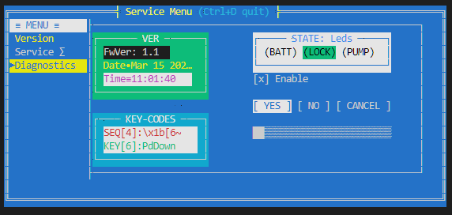
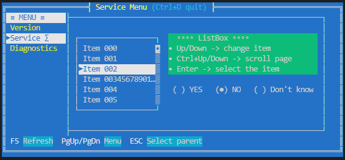

# TWins in brief

`TWins` is a C++ library designed to allow a developer to create graphical terminal applications on non-os platforms, like bare Cortex-M3.
It provides basic facilities required by interactive applications such as screen and cursor management, keyboard input, keymaps, color codes.
Additional it allows to define terminal windows and it's widgets in a convenient way as const tree of `twins::Widget` structures.




Wikipedia: [reference color tables for different terminals](https://en.m.wikipedia.org/wiki/ANSI_escape_code)

## References

Implementation is based on examples:

* https://github.com/fidian/ansi/blob/master/ansi
* https://github.com/stark/Color-Scripts
* https://wiki.bash-hackers.org/scripting/terminalcodes
* http://0x80.pl/articles/terminals.html
* https://www.jedsoft.org/slang/
* https://www.systutorials.com/docs/linux/man/4-console_codes/#lbAF

## Primary goals

- text properties
    - [x] foreground and background color codes
    - [x] attributes (bold, inversion)
- operations
    - [x] clear screen
    - [x] go to home
    - [x] go to location
- reading input
    - [x] regular characters (a..z)
    - [x] control codes (Up/Down, Del, Ctrl, Home, ...)
- [ ] two modes: direct terminal output and buffered  
    buffered mode is required on UART terminals due to slow refresh rate and ugly flickering
- [x] separation layer to ease porting

## Secondary goals

- widgets (controls) to implement
    - [x] window
    - [x] panel
    - [x] static label / led
    - [x] check box
    - [ ] edit field (text/number)
    - [x] radio button
    - [x] page control
    - [x] progress bar
    - [x] list
    - [ ] drop down list
    - [x] canvas
- navigation
    - [x] widgets navigation by Tab/Esc key
    - [x] render focused widget state
    - [ ] blinking cursor instead of inversed colors
    - [x] select widget by mouse
- notifications
    - [x] notify event per widget type (button clicked, checkbox toggled)
- [ ] color theme for window
- [x] return if keyboard key was handled by active widget
- [x] support for mouse click

## How to build

Project is CMake-based and contains two targets: *TWinsDemo* and *TWinsUT*.  
Demo is enabled by default, unit tests has to be enabled in commandline or in `ccmake`.

```bash
mkdir build && cd build
cmake -DTWINS_BUILD_UT=ON ..
make -j
ctest -V
```

Run demo:

```bash
./bin/TWinsDemo
```

If you have `gcovr` installed, after running tests you can generate test coverage HTML report

```bash
make twins_cov_only
```

---
