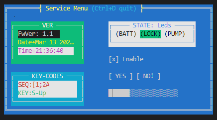

# TWins in brief

`TWins` is a C++ library designed to allow a developer to create graphical terminal applications on non-os platforms, like bare Cortex-M3.
It provides basic facilities required by interactive applications such as screen and cursor management, keyboard input, keymaps, color codes.
Additional it allows to define terminal windows and it's widgets in a convenient way as const tree of `twins::Widget` structures.

Wikipedia: [reference color tables for different terminals](https://en.m.wikipedia.org/wiki/ANSI_escape_code)

## References

Implementation is based on examples:

* https://github.com/fidian/ansi/blob/master/ansi
* https://github.com/stark/Color-Scripts
* https://wiki.bash-hackers.org/scripting/terminalcodes
* http://0x80.pl/articles/terminals.html
* https://www.jedsoft.org/slang/

## Primary goals

* text properties
    * foreground and background color codes
    * attributes (bold, inversion)
* operations
    * clear screen
    * go to home
    * go to location
* reading input
    * regular characters (a..z)
    * control codes (Up/Down, Del, Ctrl, Home, ...)
* two modes: direct terminal output and buffered  
    buffered mode is required on UART terminals due to slow refresh rate and ugly flickering
* separation layer to ease porting

## Secondary goals

Widgets (controls) to implement:

* window
* panel
* static label / led
* check box
* edit field (text/number)
* radio group
* button group
* page control
* progress bar

---

Hope I'll deal with it :)
