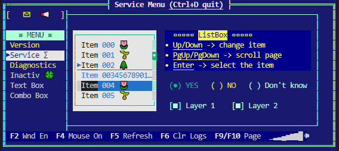

[](https://coveralls.io/github/marmidr/twins)

# TWins in brief

`TWins` is a C++ library designed for easy creation of visual terminal applications on non-os platforms, like bare Cortex-M3.
It provides basic facilities required by interactive applications such as screen and cursor management, keyboard input, keymaps, color codes.
User can also define terminal windows and it's widgets in a convenient way as const tree of `twins::Widget` structures.





## References

Implementation is based on examples:

* https://github.com/fidian/ansi/blob/master/ansi - great bash script providing most of the codes for terminal use
* https://github.com/stark/Color-Scripts
* https://wiki.bash-hackers.org/scripting/terminalcodes
* http://0x80.pl/articles/terminals.html
* https://www.jedsoft.org/slang/
* https://www.systutorials.com/docs/linux/man/4-console_codes/#lbAF
* https://rdrr.io/cran/fansi/man/sgr_to_html.html
* [Wiki: reference color tables for different terminals](https://en.m.wikipedia.org/wiki/ANSI_escape_code)

## Primary goals

- text properties
    - [x] foreground and background color codes
    - [x] attributes (bold, inversion)
- operations
    - [x] clear screen
    - [x] go to home
    - [x] go to location
- reading input
    - [x] regular characters (a..z)
    - [x] control codes (Up/Down, Del, Ctrl, Home, ...)
- [x] buffered terminal output
- [x] platform abstraction layer (PAL) to ease porting
- [ ] make it compile in clang
- [x] command line interface with history (CLI)

## Secondary goals

- widgets (controls) to implement
    - [x] window
    - [x] panel
    - [x] static label / led
    - [x] check box
    - [x] edit field (text/number)
    - [x] radio button
    - [x] page control
    - [x] progress bar
    - [x] list box
    - [x] combo box
    - [x] scrollable text box
    - [x] custom widget base
    - [ ] scrollbar
    - [ ] horizontal page control
    - [x] popup windows
    - [x] layers - to control visibility of groups of widgets
    - [ ] password input
- navigation
    - [x] widgets navigation by Tab/Esc key
    - [x] render focused widget state
    - [x] blinking cursor instead of inversed colors
    - [x] select widget by mouse
- notifications
    - [x] notify event per widget type (button clicked, checkbox toggled)
- [x] color theme for window
- [x] keyboard handler returns if key was handled by active widget
- [x] support for mouse click
- [x] double-width character support (emoticons 😁)
- [x] multiline solid button


# Prerequisites

Library is using C++14 and reguires gcc 7.5 or never.

```bash
sudo apt install g++ cmake cmake-curses-gui
```

# How to build demo

Project is CMake-based and contains two targets: *TWinsDemo* and *TWinsUT*.  
Tests are enabled by default, Demo has to be enabled from commandline or in `ccmake .`.

```bash
mkdir build && cd build
cmake -DTWINS_BUILD_DEMO=ON -DTWINS_THEME_DIR="../demo/inc/" ..
make -j
```

### Run GUI demo:

```bash
./bin/TWinsDemo
```

### Run CLI demo:

```bash
./bin/TWinsDemo --cli
```

## How to build unit tests

TWins tests are using google test library as a submodule.
The first step is to fetch the library:

```bash
cmake -DTWINS_BUILD_UT=ON ..
git submodule update --init
```

You can also turn on building of the tests with `ccmake`:  
Go to build/ and use `ccmake .` to turn on `TWINS_BUILD_UT`.  
Press `c` -> `c` -> `g` to reconfigure build scripts

### Build and run the tests

```bash
make -j
ctest -V
```

If you have `gcovr` installed, after running tests you can generate test coverage HTML report

```bash
make twins_cov_only
firefox cover_html/cover.html
```

---
